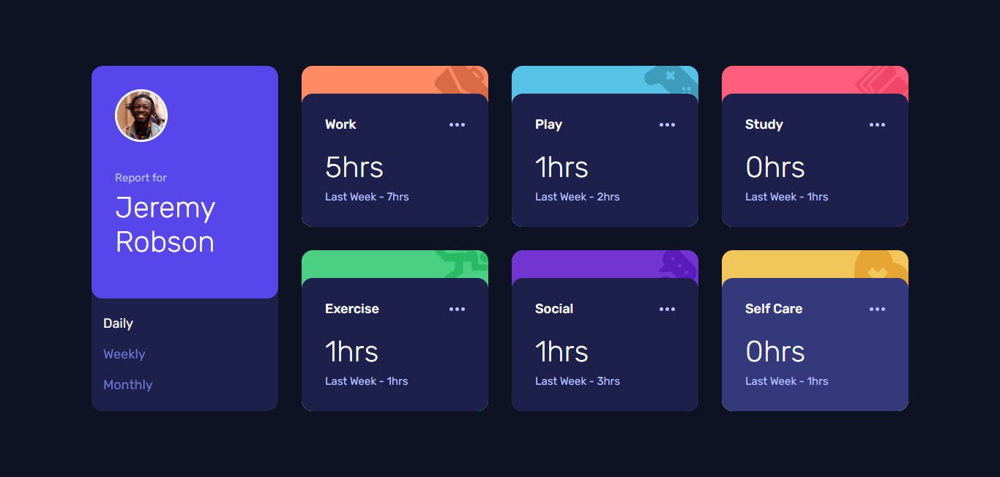

# Frontend Mentor - Time tracking dashboard solution

This is a solution to the [Time tracking dashboard challenge on Frontend Mentor](https://www.frontendmentor.io/challenges/time-tracking-dashboard-UIQ7167Jw). Frontend Mentor challenges help you improve your coding skills by building realistic projects.

## Table of contents

- [Overview](#overview)
  - [The challenge](#the-challenge)
  - [Screenshot](#screenshot)
  - [Links](#links)
- [My process](#my-process)
  - [Built with](#built-with)
  - [What I learned](#what-i-learned)
  - [Useful resources](#useful-resources)
- [Author](#author)

## Overview

### The challenge

Users should be able to:

- View the optimal layout for the site depending on their device's screen size
- See hover states for all interactive elements on the page
- Switch between viewing Daily, Weekly, and Monthly stats

### Screenshot



### Links

- Solution URL: [Add solution URL here](https://your-solution-url.com)
- Live Site URL: [Time Tracking Dashboard Demo](https://gustavo2023.github.io/time-tracking-dashboard/)

## My process

### Built with

- Semantic HTML5 markup
- CSS custom properties
- Flexbox
- CSS Grid
- Mobile-first workflow
- JavaScript

### What I learned

- **Data Attributes:** Learned about data attributes (```data-*```) which allow embedding custom data into HTML elements, which can be easily accessed and manipulated using JavaScript with the ```dataset``` property.
- **Fetch API:** Used the Fetch API to make network requests. This returns a ```Promise```, which allows to handle asynchronous operations cleanly.

### Useful resources

- [Using data attributes](https://developer.mozilla.org/en-US/docs/Learn_web_development/Howto/Solve_HTML_problems/Use_data_attributes) - This helped me understand the use of data attributes and how to take advantage of the with JavaScript.
- [Making network requests with JavaScript](https://developer.mozilla.org/en-US/docs/Learn_web_development/Core/Scripting/Network_requests) - This is resource explains how to make network requests with JavaScript by using the Fetch API.

## Author

- Frontend Mentor - [@gustavo2023](https://www.frontendmentor.io/profile/gustavo2023)
